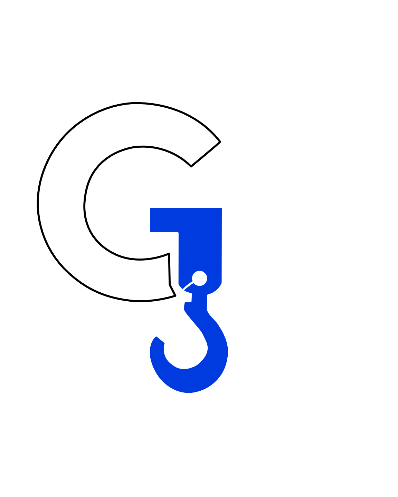

<!DOCTYPE html>
<html lang="es">
<head>
  <meta charset="UTF-8" />
  <meta name="viewport" content="width=device-width, initial-scale=1.0" />
  <meta name="description" content="Grúas Fernández — servicio profesional de grúas, izaje y transporte de carga." />
  <meta name="theme-color" content="#0b4bea" />
  <title>Grúas Fernández | Fuerza que mueve tu proyecto</title>
  <link rel="icon" type="image/png" href="assets/logo.png" />
  <link rel="stylesheet" href="styles.css" />
</head>

<body>
  <header class="site-header" id="inicio">
    <nav class="nav container" aria-label="Navegación principal">
      <a class="brand" href="#inicio" aria-label="Grúas Fernández, inicio">
        
        GRÚAS <strong>FERNÁNDEZ</strong>
      </a>

      <button class="nav-toggle" aria-label="Abrir menú" aria-expanded="false">
        
      </button>

      

        <a href="#servicios">Servicios</a>
        <a href="#nosotros">Nosotros</a>
        <a href="#proceso">Cómo trabajamos</a>
        <a href="#contacto" class="nav-cta">Cotizar</a>
      

    </nav>
  </header>

  <main>
    <section class="hero">
      

      

      

        

          
 GRÚAS • CARGA • IZAMIENTO

          <h1>La fuerza que <em>mueve</em> tu proyecto.</h1>
          

            Soluciones de grúa y manejo de carga pensadas para trabajar con
            precisión, seguridad y una respuesta profesional.
          

          

            <a class="btn btn-primary" href="#contacto">Solicitar cotización ↗</a>
            <a class="btn btn-ghost" href="#servicios">Ver servicios</a>
          

          

            
<strong>01</strong>Planeación

            
<strong>02</strong>Operación

            
<strong>03</strong>Entrega

          

        

        

          

          
          
GF / MOVIMIENTO &amp; FUERZA

        

      

      

        GRÚAS FERNÁNDEZ
        PRECISIÓN · FUERZA · CONFIANZA
      

    </section>

    <section class="services section" id="servicios">
      

        

          

            
 NUESTROS SERVICIOS

            <h2>Soluciones para <em>mover lo que importa.</em></h2>
          

          

            Cada operación necesita una solución diferente. Diseñamos el servicio
            alrededor del tipo de carga, el espacio y las condiciones del trabajo.
          

        

        

          <article class="service-card featured reveal">
            01
            
↗

            <h3>Servicio de grúa</h3>
            
Apoyo para elevación y movimiento de cargas en proyectos y operaciones que requieren capacidad y control.

            
          </article>

          <article class="service-card reveal delay-1">
            02
            
⌁

            <h3>Izaje y maniobras</h3>
            
Planeación de maniobras para mover cargas de forma ordenada, precisa y eficiente.

            
          </article>

          <article class="service-card reveal delay-2">
            03
            
▱

            <h3>Carga y transporte</h3>
            
Soluciones para apoyar el traslado y posicionamiento de equipos, materiales y estructuras.

            
          </article>
        

      

    </section>

    <section class="about section dark-section" id="nosotros">
      

        

          
FERNÁNDEZ

          

            
          

          
GF <small>EST.</small>

        

        

          
 SOBRE NOSOTROS

          <h2>Más que levantar una carga. <em>Movemos proyectos.</em></h2>
          

            En Grúas Fernández entendemos que detrás de cada maniobra hay una obra,
            una empresa y una fecha que cumplir. Por eso nuestro enfoque combina
            fuerza operativa con planeación y atención cercana.
          

          

            Queremos ser el aliado que responde cuando el trabajo exige capacidad,
            coordinación y confianza.
          

          

            
<b>01</b>Planeación antes de cada operación

            
<b>02</b>Enfoque en seguridad y control

            
<b>03</b>Comunicación clara con el cliente

          

        

      

    </section>

    <section class="process section" id="proceso">
      

        

          

            
 NUESTRO PROCESO

            <h2>Simple. Claro. <em>Profesional.</em></h2>
          

        

        

          <article class="process-item reveal">
            01
            
<h3>Cuéntanos qué necesitas</h3>
Comparte el tipo de carga, ubicación y características generales del trabajo.

            <b>→</b>
          </article>
          <article class="process-item reveal delay-1">
            02
            
<h3>Analizamos la operación</h3>
Revisamos las condiciones para plantear una solución adecuada.

            <b>→</b>
          </article>
          <article class="process-item reveal delay-2">
            03
            
<h3>Coordinamos el servicio</h3>
Acordamos los detalles de la operación y los tiempos de trabajo.

            <b>→</b>
          </article>
          <article class="process-item reveal delay-3">
            04
            
<h3>Ejecutamos con precisión</h3>
Realizamos la maniobra con foco en coordinación, control y seguridad.

            <b>✓</b>
          </article>
        

      

    </section>

    <section class="quote-section" id="contacto">
      

        

          
 HABLEMOS DE TU PROYECTO

          <h2>¿Necesitas <em>mover algo?</em></h2>
          
Cuéntanos qué necesitas y prepara la información básica para recibir una cotización.

          

            GF
            

              <strong>Grúas Fernández</strong>
              <small>Servicio de grúas · Carga · Izamiento</small>
            

          

        

        <form class="quote-form reveal delay-1" id="quoteForm">
          <label>
            Nombre
            <input type="text" name="name" placeholder="Tu nombre" required />
          </label>

          <label>
            Teléfono
            <input type="tel" name="phone" placeholder="Tu número" required />
          </label>

          <label>
            ¿Qué necesitas?
            <select name="service" required>
              <option value="" selected disabled>Selecciona un servicio</option>
              <option>Servicio de grúa</option>
              <option>Izaje y maniobras</option>
              <option>Carga y transporte</option>
              <option>Otro / asesoría</option>
            </select>
          </label>

          <label>
            Cuéntanos sobre el trabajo
            <textarea name="message" rows="4" placeholder="Ubicación, tipo de carga, fecha aproximada..." required></textarea>
          </label>

          <button class="btn btn-primary form-button" type="submit">Preparar solicitud ↗</button>
          
El botón abrirá tu aplicación de correo con la solicitud preparada. Configura el correo de destino en <code>script.js</code>.

          

        </form>
      

    </section>
  </main>

  <footer class="footer">
    

      <a class="brand footer-brand" href="#inicio">
        
        GRÚAS <strong>FERNÁNDEZ</strong>
      </a>
      
Fuerza que mueve tu proyecto.

      

        <a href="#servicios">Servicios</a>
        <a href="#nosotros">Nosotros</a>
        <a href="#contacto">Cotizar</a>
      

    

    
©  Grúas Fernández. Todos los derechos reservados.

  </footer>

  
</body>
</html>
